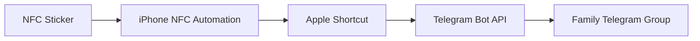

# NFC DogBot

NFC DogBot is an NFC-triggered iPhone automation that sends timestamped dog-feeding notifications to a private Telegram group.

## How It Works



When a configured iPhone scans the NFC sticker:

1. The NFC personal automation runs immediately.
2. Apple Shortcuts generates the current time.
3. The Shortcut sends an authenticated HTTP POST request directly to the Telegram Bot API.
4. DogBot posts a timestamped message in the family Telegram group.

Example:

> 🐶 DogBot: The dogs were fed at 2:15 PM.

## Technologies

- JavaScript
- NFC
- Apple Shortcuts
- Telegram Bot API
- REST APIs
- HTTP POST requests

## Features

- Automatically sends a dog-feeding update after an NFC scan
- Includes the current feeding time
- Posts through a dedicated Telegram bot
- Does not require a hosted server
- Supports multiple family members using the same physical NFC sticker
- Includes JavaScript utilities for Telegram setup and testing

## Project Files

- `dogbot.js` — Generates and sends a timestamped test message through DogBot
- `get-chat-id.js` — Retrieves the Telegram group chat ID during setup
- `.env.example` — Shows the required configuration without exposing real credentials
- `.gitignore` — Prevents private credentials from being committed

The JavaScript files are setup and testing utilities. The live NFC workflow runs directly from the iPhone through Apple Shortcuts.

## Repository Structure

```text
DOGBOT/
├── .env
├── .env.example
├── .gitignore
├── README.md
├── dogbot.js
└── get-chat-id.js
```

The real `.env` file must remain private and should never be uploaded.

## Environment Variables

Create a local `.env` file containing:

```env
TELEGRAM_BOT_TOKEN=your_private_bot_token
TELEGRAM_CHAT_ID=your_private_group_chat_id
```

The `.env.example` file should contain placeholders only:

```env
TELEGRAM_BOT_TOKEN=your_bot_token_here
TELEGRAM_CHAT_ID=your_chat_id_here
```

## JavaScript Utilities

### `dogbot.js`

Creates a timestamped message and sends it to the configured Telegram group.

Example message:

```text
🐶 DogBot: The dogs were fed at 2:15 PM.
```

### `get-chat-id.js`

Reads Telegram bot updates and identifies the group chat ID required by the Telegram Bot API.

These utilities helped configure and verify the Telegram integration before connecting it to the NFC automation.

## Apple Shortcut Workflow

The `Feed Dogs` Shortcut performs the following actions:

1. Gets the current date and time
2. Formats the time
3. Creates the dog-feeding message
4. Sends an HTTP POST request to Telegram's `sendMessage` endpoint
5. Includes the group chat ID and generated message in the request body

## NFC Automation

Each family member configures the NFC automation separately on their own iPhone:

1. Open Apple Shortcuts
2. Select **Automation**
3. Create an **NFC** automation
4. Scan the shared NFC sticker
5. Select **Run Immediately**
6. Run the `Feed Dogs` Shortcut
7. Save the automation

Multiple iPhones can recognize the same physical NFC sticker, but each device requires its own personal automation.

## Security

This repository does not include:

- The real Telegram bot token
- The private Telegram group chat ID
- An exported Shortcut containing credentials
- Screenshots displaying private API information

The `.env` file is excluded from Git through `.gitignore`.

Anyone recreating this project should generate their own Telegram bot token and group chat ID.

## Future Improvements

- Include the name of the person who fed the dogs
- Prevent duplicate notifications within a short period
- Track feeding history
- Support separate breakfast and dinner events
- Add medication and water notifications