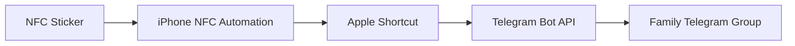

# NFC Dog Feeding Automation

An NFC-triggered iPhone automation that sends a personalized, timestamped dog-feeding notification to a private Telegram group.

## How It Works



When a configured iPhone scans the NFC sticker:

1. The NFC personal automation runs immediately.
2. Apple Shortcuts gets and formats the current time.
3. The personalized Shortcut includes the family member's name.
4. The Shortcut sends an HTTP POST request directly to the Telegram Bot API.
5. The Telegram bot posts the update in the family group.

Message format:

> [Name] fed the dogs at [Formatted Time].

Example messages:

> Chris fed the dogs at 6:42 PM.  
> Mom fed the dogs at 8:10 AM.  
> Michael fed the dogs at 5:35 PM.

## Technologies

- JavaScript
- NFC
- Apple Shortcuts
- Telegram Bot API
- REST APIs
- HTTP POST requests
- iPhone personal automations

## Features

- Sends a dog-feeding update automatically after an NFC scan
- Identifies which family member fed the dogs
- Includes the formatted feeding time
- Posts through a dedicated Telegram bot
- Does not require a hosted server
- Supports multiple family members using the same NFC sticker
- Includes JavaScript utilities for setup and local testing

## Live Workflow

The working NFC system runs directly from each family member's iPhone:

```text
NFC Sticker
→ iPhone NFC Automation
→ Apple Shortcut
→ Telegram Bot API
→ Family Telegram Group
```

The live NFC workflow does not require a computer or hosted backend after setup.

## Project Files

```text
DogBot/
├── .env
├── .env.example
├── .gitignore
├── README.md
├── dogbot.js
└── get-chat-id.js
```

- `dogbot.js` — Sends a personalized, timestamped test message
- `get-chat-id.js` — Retrieves the Telegram group chat ID during setup
- `.env.example` — Documents the required configuration without exposing credentials
- `.gitignore` — Prevents private credentials from being committed
- `README.md` — Explains the project and setup

The real `.env` file must remain private and should never be uploaded to GitHub.

## Environment Variables

Create a local `.env` file:

```env
TELEGRAM_BOT_TOKEN=your_private_bot_token
TELEGRAM_CHAT_ID=your_private_group_chat_id
PERSON_NAME=Chris
```

The public `.env.example` file should contain placeholders only:

```env
TELEGRAM_BOT_TOKEN=your_bot_token_here
TELEGRAM_CHAT_ID=your_chat_id_here
PERSON_NAME=your_name_here
```

## JavaScript Utility

The included `dogbot.js` utility:

1. Reads the family member's name from `PERSON_NAME`
2. Generates the current time
3. Creates the message
4. Sends it through the Telegram Bot API

Example generated message:

```text
Chris fed the dogs at 6:42 PM.
```

The JavaScript utility was used during setup and testing. The production NFC workflow sends its request directly from Apple Shortcuts.

## Apple Shortcut Workflow

Each family member has a personalized copy of the `Feed Dogs` Shortcut.

The Shortcut performs these actions:

1. Gets the current date and time
2. Formats the time
3. Creates a personalized message

```text
Chris fed the dogs at [Formatted Time].
```

4. Sends an HTTP POST request to Telegram's `sendMessage` endpoint
5. Includes the Telegram group chat ID and message in the JSON request body

Each family member changes the name in their own copy:

```text
Chris fed the dogs at [Formatted Time].
Mom fed the dogs at [Formatted Time].
Michael fed the dogs at [Formatted Time].
Dad fed the dogs at [Formatted Time].
```

## NFC Automation Setup

Each family member must configure the automation separately on their own iPhone:

1. Install their personalized copy of the `Feed Dogs` Shortcut
2. Open the Shortcuts app
3. Select **Automation**
4. Create a new **NFC** automation
5. Scan the shared NFC sticker
6. Select **Run Immediately**
7. Choose the `Feed Dogs` Shortcut
8. Save the automation

The same physical NFC sticker can be used by multiple iPhones, but each device requires its own personal automation.

## Telegram Request

The Shortcut sends a POST request to:

```text
https://api.telegram.org/botYOUR_BOT_TOKEN/sendMessage
```

The JSON request body contains:

```json
{
  "chat_id": "YOUR_TELEGRAM_CHAT_ID",
  "text": "[Name] fed the dogs at [Formatted Time]."
}
```

## Security

The Telegram bot token must remain private.

This repository does not include:

- The real Telegram bot token
- The private Telegram group chat ID
- The private `.env` file
- An exported Apple Shortcut containing credentials
- Screenshots displaying credentials

Anyone recreating this project should create their own Telegram bot and use their own private credentials.

## Future Improvements

- Prevent duplicate notifications within a short time period
- Track feeding history
- Support separate breakfast and dinner events
- Add medication and water notifications
- Add confirmation sounds or vibrations
- Create a simple feeding-status dashboard